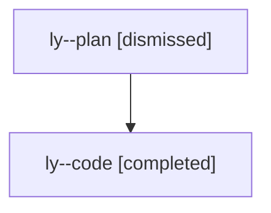

# Family: ly

[Agent Hoods](../README.md) / [bbugyi200](../users/bbugyi200/README.md) / [athena](../users/bbugyi200/machines/athena/README.md) / [ly](../users/bbugyi200/machines/athena/hoods/ly/README.md) / ly

Owner: `bbugyi200.athena` · Hood: `ly` · Members: 2

## Lineage

The diagram is an optional enhancement; the ordered table below contains the same lineage in accessible text.

| Role | Agent | State | Model / provider | Timing | Commits | Prompt | Chat |
|---|---|---|---|---|---:|---|---|
| plan | ly--plan | dismissed | opus / claude | 2026-07-27T06:44:44.909476 → 2026-07-27T07:50:13.514919 | 0 | — | [Chat](../agents/bbugyi200.athena.ly--plan/chat.md) |
| code | ly--code | completed | gpt-5.6-sol / codex | 2026-07-27T10:57:27.359679+00:00 | [1](../agents/bbugyi200.athena.ly--code/README.md#commits) | — | [Chat](../agents/bbugyi200.athena.ly--code/chat.md) |

## Commits

| Role | Repo | Commit | Subject | Committed (UTC) |
|---|---|---|---|---|
| code | sase | [`d6688f1`](https://github.com/sase-org/sase/commit/d6688f133b0320d413d2bb4a2c857a15ddaa9782) | fix(ace): preserve prompt space below frontmatter panel | 2026-07-27 11:48:37 |
