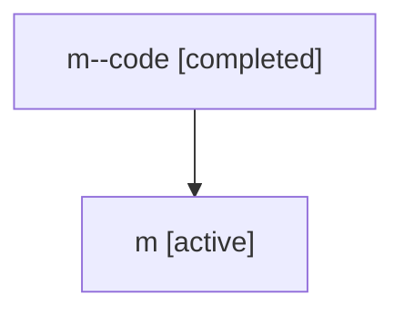

# Family: m

Owner: `bbugyi200.athena` · Hood: `m` · Members: 2

## Lineage

The diagram is an optional enhancement; the ordered table below contains the same lineage in accessible text.

| Role | Agent | State | Model / provider | Timing | Commits | Prompt | Chat |
|---|---|---|---|---|---:|---|---|
| code | m--code | completed | gpt-5.5 / codex | 2026-07-06T19:52:31.660276+00:00 | 0 | — | [Chat](../agents/bbugyi200.athena.m--code/chat.md) |
| root | m | active | gpt-5.5 / codex | 2026-07-06T19:49:17.252683+00:00 | 1 | [Prompt](../agents/bbugyi200.athena.m/prompt.md) | [Chat](../agents/bbugyi200.athena.m/chat.md) |
