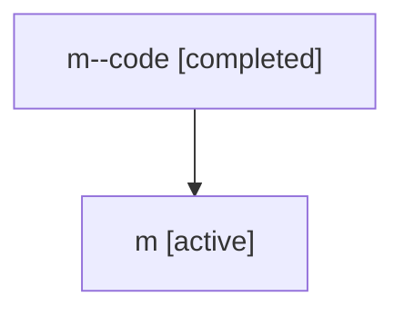

# Family: m

[Agent Hoods](../README.md) / [bbugyi200](../users/bbugyi200/README.md) / [athena](../users/bbugyi200/machines/athena/README.md) / [m](../users/bbugyi200/machines/athena/hoods/m/README.md) / m

Owner: `bbugyi200.athena` · Hood: `m` · Members: 2

## Lineage

The diagram is an optional enhancement; the ordered table below contains the same lineage in accessible text.

| Role | Agent | State | Model / provider | Timing | Commits | Prompt | Chat |
|---|---|---|---|---|---:|---|---|
| code | m--code | completed | gpt-5.5 / codex | 2026-07-06T19:52:31.660276+00:00 | 0 | — | [Chat](../agents/bbugyi200.athena.m--code/chat.md) |
| root | m | active | gpt-5.5 / codex | 2026-07-06T19:49:17.252683+00:00 | [1](../agents/bbugyi200.athena.m/README.md#commits) | [Prompt](../agents/bbugyi200.athena.m/prompt.md) | [Chat](../agents/bbugyi200.athena.m/chat.md) |

## Commits

| Role | Repo | Commit | Subject | Committed (UTC) |
|---|---|---|---|---|
| root | sase | [`415ff51`](https://github.com/sase-org/sase/commit/415ff51766ff8ad65b66b139872f3793126431b0) | chore: Add SDD prompt and plan for telegram\_project\_display\_names | 2026-07-06 19:52:30 |
