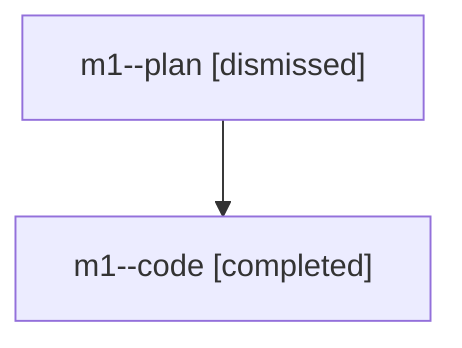

# Family: m1

[Agent Hoods](../README.md) / [bbugyi200](../users/bbugyi200/README.md) / [athena](../users/bbugyi200/machines/athena/README.md) / [m1](../users/bbugyi200/machines/athena/hoods/m1/README.md) / m1

Owner: `bbugyi200.athena` · Hood: `m1` · Members: 2

## Lineage

The diagram is an optional enhancement; the ordered table below contains the same lineage in accessible text.

| Role | Agent | State | Model / provider | Timing | Commits | Prompt | Chat |
|---|---|---|---|---|---:|---|---|
| plan | m1--plan | dismissed | opus / claude | 2026-07-27T07:27:32.762927 → 2026-07-27T08:00:34.092599 | 0 | — | [Chat](../agents/bbugyi200.athena.m1--plan/chat.md) |
| code | m1--code | completed | gpt-5.6-sol / codex | 2026-07-27T11:38:49.777005+00:00 | [1](../agents/bbugyi200.athena.m1--code/README.md#commits) | — | [Chat](../agents/bbugyi200.athena.m1--code/chat.md) |

## Commits

| Role | Commit | Subject | Committed (UTC) |
|---|---|---|---|
| code | [`b3f400c`](https://github.com/sase-org/sase/commit/b3f400c8ea1e621da88f1c892a594e39438de0ee) | fix: honor projected buckets in clan counts | 2026-07-27 11:59:55 |
