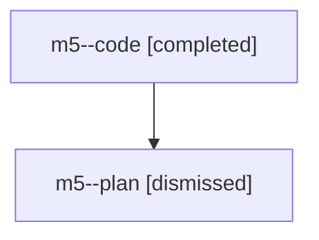

# Family: m5

[Agent Hoods](../README.md) / [bbugyi200](../users/bbugyi200/README.md) / [athena](../users/bbugyi200/machines/athena/README.md) / [m5](../users/bbugyi200/machines/athena/hoods/m5/README.md) / m5

Owner: `bbugyi200.athena` · Hood: `m5` · Members: 2

## Lineage

The diagram is an optional enhancement; the ordered table below contains the same lineage in accessible text.

| Role | Agent | State | Model / provider | Timing | Commits | Prompt | Chat |
|---|---|---|---|---|---:|---|---|
| code | m5--code | completed | gpt-5.6-sol / codex | 2026-07-27T12:40:17.131709+00:00 | [1](../agents/bbugyi200.athena.m5--code/README.md#commits) | — | [Chat](../agents/bbugyi200.athena.m5--code/chat.md) |
| plan | m5--plan | dismissed | opus / claude | 2026-07-27T08:32:41.785326 → 2026-07-27T09:04:23.445350 | 0 | — | [Chat](../agents/bbugyi200.athena.m5--plan/chat.md) |

## Commits

| Role | Repo | Commit | Subject | Committed |
|---|---|---|---|---|
| code | sase | [`672ecbb`](https://github.com/sase-org/sase/commit/672ecbb4c835507817b78af6c573c399145c3b08) | feat(bead): add list output formats | 2026-07-27 09:03:42 EDT |
