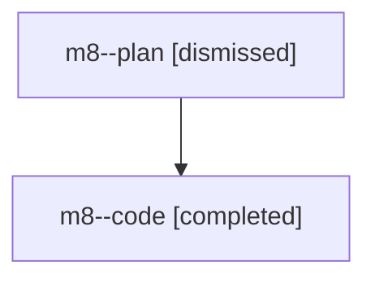

# Family: m8

[Agent Hoods](../README.md) / [bbugyi200](../users/bbugyi200/README.md) / [athena](../users/bbugyi200/machines/athena/README.md) / [m8](../users/bbugyi200/machines/athena/hoods/m8/README.md) / m8

Owner: `bbugyi200.athena` · Hood: `m8` · Members: 2

## Lineage

The diagram is an optional enhancement; the ordered table below contains the same lineage in accessible text.

| Role | Agent | State | Model / provider | Timing | Commits | Prompt | Chat |
|---|---|---|---|---|---:|---|---|
| plan | m8--plan | dismissed | claude-fable-5 / claude | 2026-07-27T09:12:50.174250 → 2026-07-27T09:58:37.385264 | 0 | — | [Chat](../agents/bbugyi200.athena.m8--plan/chat.md) |
| code | m8--code | completed | gpt-5.6-sol / codex | 2026-07-27T13:39:17.605266+00:00 | [1](../agents/bbugyi200.athena.m8--code/README.md#commits) | — | [Chat](../agents/bbugyi200.athena.m8--code/chat.md) |

## Commits

| Role | Repo | Commit | Subject | Committed (UTC) |
|---|---|---|---|---|
| code | sase | [`39aa7cf`](https://github.com/sase-org/sase/commit/39aa7cf172a8b34d9c5300940193cef451945249) | docs(beads): refresh command skill accuracy | 2026-07-27 13:57:59 |
