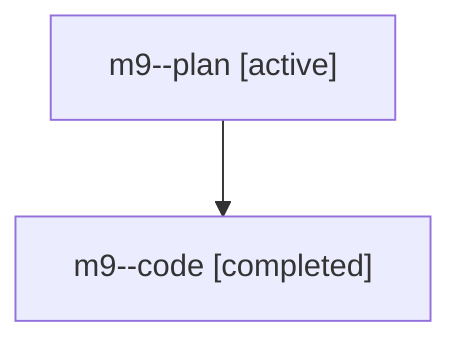

# Family: m9

[Agent Hoods](../README.md) / [bbugyi200](../users/bbugyi200/README.md) / [athena](../users/bbugyi200/machines/athena/README.md) / [m9](../users/bbugyi200/machines/athena/hoods/m9/README.md) / m9

Owner: `bbugyi200.athena` · Hood: `m9` · Members: 2

## Lineage

The diagram is an optional enhancement; the ordered table below contains the same lineage in accessible text.

| Role | Agent | State | Model / provider | Timing | Commits | Prompt | Chat |
|---|---|---|---|---|---:|---|---|
| plan | m9--plan | active | opus / claude | 2026-07-27T14:33:35.626540+00:00 | 0 | [Prompt](../agents/bbugyi200.athena.m9--plan/prompt.md) | [Chat](../agents/bbugyi200.athena.m9--plan/chat.md) |
| code | m9--code | completed | gpt-5.6-sol / codex | 2026-07-27T14:42:32.802899+00:00 | [1](../agents/bbugyi200.athena.m9--code/README.md#commits) | — | [Chat](../agents/bbugyi200.athena.m9--code/chat.md) |

## Commits

| Role | Repo | Commit | Subject | Committed |
|---|---|---|---|---|
| code | sase | [`d51475b`](https://github.com/sase-org/sase/commit/d51475b249f77dbd8760df96cc268e24a9f7d2e1) | feat(bead): add show output formats | 2026-07-27 11:13:19 EDT |
