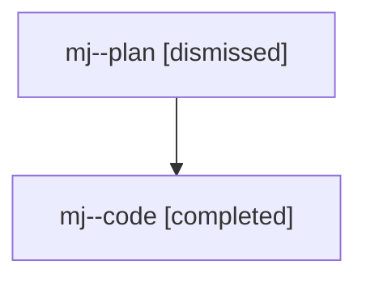

# Family: mj

[Agent Hoods](../README.md) / [bbugyi200](../users/bbugyi200/README.md) / [athena](../users/bbugyi200/machines/athena/README.md) / [mj](../users/bbugyi200/machines/athena/hoods/mj/README.md) / mj

Owner: `bbugyi200.athena` · Hood: `mj` · Members: 2

## Lineage

The diagram is an optional enhancement; the ordered table below contains the same lineage in accessible text.

| Role | Agent | State | Model / provider | Timing | Commits | Prompt | Chat |
|---|---|---|---|---|---:|---|---|
| plan | mj--plan | dismissed | gpt-5.6-sol / codex | 2026-07-27T15:21:25.485903 → 2026-07-27T15:54:59.272471 | 0 | — | [Chat](../agents/bbugyi200.athena.mj--plan/chat.md) |
| code | mj--code | completed | gpt-5.6-sol / codex | 2026-07-27T19:26:56.261053+00:00 | [1](../agents/bbugyi200.athena.mj--code/README.md#commits) | — | [Chat](../agents/bbugyi200.athena.mj--code/chat.md) |

## Commits

| Role | Commit | Subject | Committed (UTC) |
|---|---|---|---|
| code | [`cfbac39`](https://github.com/sase-org/sase/commit/cfbac3928a5039a06090e7e4cdf5ce2ef47ee862) | fix: make approved plan linking atomic | 2026-07-27 19:54:21 |
