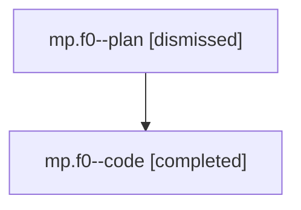

# Family: mp.f0

[Agent Hoods](../README.md) / [bbugyi200](../users/bbugyi200/README.md) / [athena](../users/bbugyi200/machines/athena/README.md) / [mp](../users/bbugyi200/machines/athena/hoods/mp/README.md) / mp.f0

Owner: `bbugyi200.athena` · Hood: `mp` · Members: 2

## Lineage

The diagram is an optional enhancement; the ordered table below contains the same lineage in accessible text.

| Role | Agent | State | Model / provider | Timing | Commits | Prompt | Chat |
|---|---|---|---|---|---:|---|---|
| plan | mp.f0--plan | dismissed | opus / claude | 2026-07-28T08:35:14.596935 → 2026-07-28T09:14:57.489934 | 0 | — | [Chat](../agents/bbugyi200.athena.mp.f0--plan/chat.md) |
| code | mp.f0--code | completed | gpt-5.6-sol / codex | 2026-07-28T12:47:13.063401+00:00 | [1](../agents/bbugyi200.athena.mp.f0--code/README.md#commits) | — | [Chat](../agents/bbugyi200.athena.mp.f0--code/chat.md) |

## Commits

| Role | Repo | Commit | Subject | Committed (UTC) |
|---|---|---|---|---|
| code | sase | [`4fb5980`](https://github.com/sase-org/sase/commit/4fb5980600a819238d77e4add6bc3487378d5d94) | fix(ace): show configured project names in commits UI | 2026-07-28 13:13:56 |

## Neighbors

| Agent | Relation | State |
|---|---|---|
| [mp](../agents/bbugyi200.athena.mp/README.md) | ancestor | completed |
