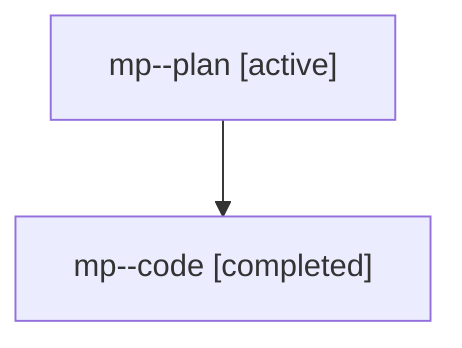

# Family: mp

[Agent Hoods](../README.md) / [bbugyi200](../users/bbugyi200/README.md) / [athena](../users/bbugyi200/machines/athena/README.md) / [mp](../users/bbugyi200/machines/athena/hoods/mp/README.md) / mp

Owner: `bbugyi200.athena` · Hood: `mp` · Members: 2

## Lineage

The diagram is an optional enhancement; the ordered table below contains the same lineage in accessible text.

| Role | Agent | State | Model / provider | Timing | Commits | Prompt | Chat |
|---|---|---|---|---|---:|---|---|
| plan | mp--plan | active | gpt-5.6-sol / codex | 2026-07-28T10:15:46.926570+00:00 | 0 | [Prompt](../agents/bbugyi200.athena.mp--plan/prompt.md) | [Chat](../agents/bbugyi200.athena.mp--plan/chat.md) |
| code | mp--code | completed | gpt-5.6-sol / codex | 2026-07-28T10:24:45.695137+00:00 | [1](../agents/bbugyi200.athena.mp--code/README.md#commits) | — | [Chat](../agents/bbugyi200.athena.mp--code/chat.md) |

## Commits

| Role | Repo | Commit | Subject | Committed |
|---|---|---|---|---|
| code | sase | [`fc72269`](https://github.com/sase-org/sase/commit/fc72269b639c93cc29cd617d5b3dd3da4d91cd3d) | feat(ace): add project facet to commits filters | 2026-07-28 07:32:59 EDT |

## Neighbors

| Agent | Relation | State |
|---|---|---|
| [mp.f0](bbugyi200.athena.mp.f0.md) (family · 2) | descendant | active 1, completed 1 |
