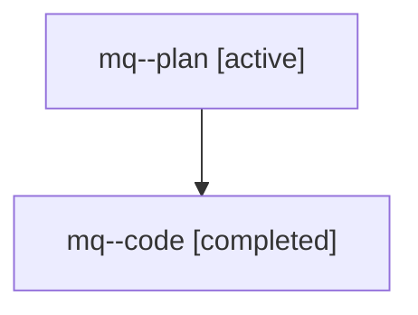

# Family: mq

[Agent Hoods](../README.md) / [bbugyi200](../users/bbugyi200/README.md) / [athena](../users/bbugyi200/machines/athena/README.md) / [mq](../users/bbugyi200/machines/athena/hoods/mq/README.md) / mq

Owner: `bbugyi200.athena` · Hood: `mq` · Members: 2

## Lineage

The diagram is an optional enhancement; the ordered table below contains the same lineage in accessible text.

| Role | Agent | State | Model / provider | Timing | Commits | Prompt | Chat |
|---|---|---|---|---|---:|---|---|
| plan | mq--plan | active | opus / claude | 2026-07-28T10:48:09.734279+00:00 | 0 | [Prompt](../agents/bbugyi200.athena.mq--plan/prompt.md) | [Chat](../agents/bbugyi200.athena.mq--plan/chat.md) |
| code | mq--code | completed | gpt-5.6-sol / codex | 2026-07-28T10:56:08.428605+00:00 | [1](../agents/bbugyi200.athena.mq--code/README.md#commits) | — | [Chat](../agents/bbugyi200.athena.mq--code/chat.md) |

## Commits

| Role | Repo | Commit | Subject | Committed |
|---|---|---|---|---|
| code | sase | [`86dd439`](https://github.com/sase-org/sase/commit/86dd439409b08005fe24758419e7d669d4c808c7) | fix: materialize beads sidecar before launch claim | 2026-07-28 07:10:27 EDT |
