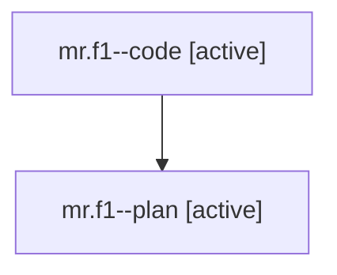

# Family: mr.f1

[Agent Hoods](../README.md) / [bbugyi200](../users/bbugyi200/README.md) / [athena](../users/bbugyi200/machines/athena/README.md) / [mr](../users/bbugyi200/machines/athena/hoods/mr/README.md) / mr.f1

Owner: `bbugyi200.athena` · Hood: `mr` · Members: 2

## Lineage

The diagram is an optional enhancement; the ordered table below contains the same lineage in accessible text.

| Role | Agent | State | Model / provider | Timing | Commits | Prompt | Chat |
|---|---|---|---|---|---:|---|---|
| code | mr.f1--code | active | gpt-5.6-sol / codex | 2026-07-28T12:01:58.345383+00:00 | 0 | — | — |
| plan | mr.f1--plan | active | opus / claude | 2026-07-28T11:44:35.721146+00:00 | 0 | [Prompt](../agents/bbugyi200.athena.mr.f1--plan/prompt.md) | [Chat](../agents/bbugyi200.athena.mr.f1--plan/chat.md) |

## Neighbors

| Agent | Relation | State |
|---|---|---|
| [mr](../agents/bbugyi200.athena.mr/README.md) | ancestor | completed |
