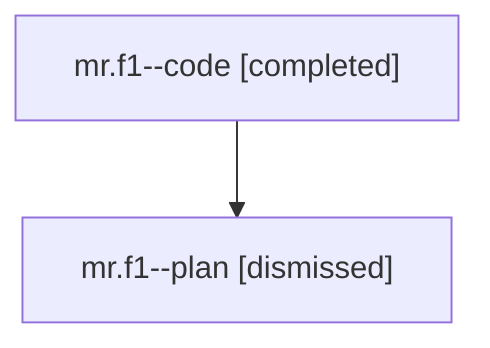

# Family: mr.f1

[Agent Hoods](../README.md) / [bbugyi200](../users/bbugyi200/README.md) / [athena](../users/bbugyi200/machines/athena/README.md) / [mr](../users/bbugyi200/machines/athena/hoods/mr/README.md) / mr.f1

Owner: `bbugyi200.athena` · Hood: `mr` · Members: 2

## Lineage

The diagram is an optional enhancement; the ordered table below contains the same lineage in accessible text.

| Role | Agent | State | Model / provider | Timing | Commits | Prompt | Chat |
|---|---|---|---|---|---:|---|---|
| code | mr.f1--code | completed | gpt-5.6-sol / codex | 2026-07-28T12:01:58.345383+00:00 | [1](../agents/bbugyi200.athena.mr.f1--code/README.md#commits) | — | [Chat](../agents/bbugyi200.athena.mr.f1--code/chat.md) |
| plan | mr.f1--plan | dismissed | opus / claude | 2026-07-28T07:44:35.721146 → 2026-07-28T09:01:13.859537 | 0 | — | [Chat](../agents/bbugyi200.athena.mr.f1--plan/chat.md) |

## Commits

| Role | Repo | Commit | Subject | Committed |
|---|---|---|---|---|
| code | sase | [`e73040a`](https://github.com/sase-org/sase/commit/e73040accf00f09ec3d7a0dbc6657114aa159805) | feat(ace): add foldable slow tool call details | 2026-07-28 09:00:18 EDT |

## Neighbors

| Agent | Relation | State |
|---|---|---|
| [mr](../agents/bbugyi200.athena.mr/README.md) | ancestor | completed |
