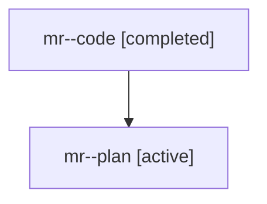

# Family: mr

[Agent Hoods](../README.md) / [bbugyi200](../users/bbugyi200/README.md) / [athena](../users/bbugyi200/machines/athena/README.md) / [mr](../users/bbugyi200/machines/athena/hoods/mr/README.md) / mr

Owner: `bbugyi200.athena` · Hood: `mr` · Members: 2

## Lineage

The diagram is an optional enhancement; the ordered table below contains the same lineage in accessible text.

| Role | Agent | State | Model / provider | Timing | Commits | Prompt | Chat |
|---|---|---|---|---|---:|---|---|
| code | mr--code | completed | gpt-5.6-sol / codex | 2026-07-28T11:02:39.327568+00:00 | [1](../agents/bbugyi200.athena.mr--code/README.md#commits) | — | [Chat](../agents/bbugyi200.athena.mr--code/chat.md) |
| plan | mr--plan | active | gpt-5.6-sol / codex | 2026-07-28T10:49:02.951540+00:00 | 0 | [Prompt](../agents/bbugyi200.athena.mr--plan/prompt.md) | [Chat](../agents/bbugyi200.athena.mr--plan/chat.md) |

## Commits

| Role | Repo | Commit | Subject | Committed |
|---|---|---|---|---|
| code | sase | [`71942fe`](https://github.com/sase-org/sase/commit/71942fe16dacc0fd1ea1819ef53b09bdd000144a) | feat(ace): keep family conversations fully visible | 2026-07-28 11:43:46 UTC |

## Neighbors

| Agent | Relation | State |
|---|---|---|
| [mr.f1](bbugyi200.athena.mr.f1.md) (family · 2) | descendant | active 1, completed 1 |
