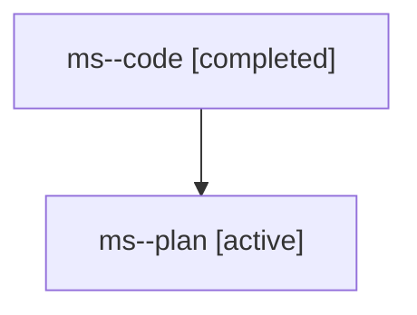

# Family: ms

[Agent Hoods](../README.md) / [bbugyi200](../users/bbugyi200/README.md) / [athena](../users/bbugyi200/machines/athena/README.md) / [ms](../users/bbugyi200/machines/athena/hoods/ms/README.md) / ms

Owner: `bbugyi200.athena` · Hood: `ms` · Members: 2

## Lineage

The diagram is an optional enhancement; the ordered table below contains the same lineage in accessible text.

| Role | Agent | State | Model / provider | Timing | Commits | Prompt | Chat |
|---|---|---|---|---|---:|---|---|
| code | ms--code | completed | gpt-5.6-sol / codex | 2026-07-28T10:55:39.522056+00:00 | [1](../agents/bbugyi200.athena.ms--code/README.md#commits) | — | [Chat](../agents/bbugyi200.athena.ms--code/chat.md) |
| plan | ms--plan | active | gpt-5.6-sol / codex | 2026-07-28T10:52:00.049639+00:00 | 0 | [Prompt](../agents/bbugyi200.athena.ms--plan/prompt.md) | [Chat](../agents/bbugyi200.athena.ms--plan/chat.md) |

## Commits

| Role | Repo | Commit | Subject | Committed |
|---|---|---|---|---|
| code | sase | [`3bd59cd`](https://github.com/sase-org/sase/commit/3bd59cdda2a0317ee4b6e60a6ed72b9f1bcec83b) | fix(memory): correct generated instruction grammar | 2026-07-28 11:12:43 UTC |
