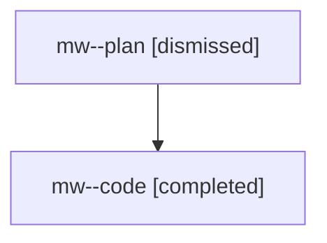

# Family: mw

[Agent Hoods](../README.md) / [bbugyi200](../users/bbugyi200/README.md) / [athena](../users/bbugyi200/machines/athena/README.md) / [mw](../users/bbugyi200/machines/athena/hoods/mw/README.md) / mw

Owner: `bbugyi200.athena` · Hood: `mw` · Members: 2

## Lineage

The diagram is an optional enhancement; the ordered table below contains the same lineage in accessible text.

| Role | Agent | State | Model / provider | Timing | Commits | Prompt | Chat |
|---|---|---|---|---|---:|---|---|
| plan | mw--plan | dismissed | opus / claude | 2026-07-28T09:18:58.864842 → 2026-07-28T09:54:26.595767 | 0 | — | [Chat](../agents/bbugyi200.athena.mw--plan/chat.md) |
| code | mw--code | completed | gpt-5.6-sol / codex | 2026-07-28T13:26:14.959290+00:00 | [1](../agents/bbugyi200.athena.mw--code/README.md#commits) | — | [Chat](../agents/bbugyi200.athena.mw--code/chat.md) |

## Commits

| Role | Repo | Commit | Subject | Committed (UTC) |
|---|---|---|---|---|
| code | sase | [`61013b2`](https://github.com/sase-org/sase/commit/61013b22957ca7c8c35c0bd93be4c2a10fc59c15) | feat(ace): render wait fields as responsive lanes | 2026-07-28 13:53:24 |
