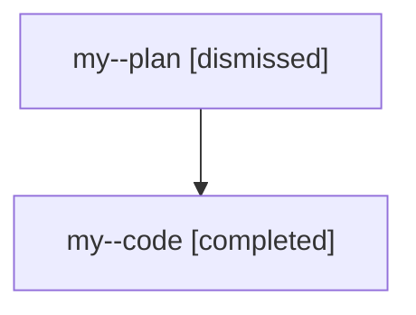

# Family: my

[Agent Hoods](../README.md) / [bbugyi200](../users/bbugyi200/README.md) / [athena](../users/bbugyi200/machines/athena/README.md) / [my](../users/bbugyi200/machines/athena/hoods/my/README.md) / my

Owner: `bbugyi200.athena` · Hood: `my` · Members: 2

## Lineage

The diagram is an optional enhancement; the ordered table below contains the same lineage in accessible text.

| Role | Agent | State | Model / provider | Timing | Commits | Prompt | Chat |
|---|---|---|---|---|---:|---|---|
| plan | my--plan | dismissed | opus / claude | 2026-07-28T09:42:32.963367 → 2026-07-28T10:36:27.118139 | 0 | — | [Chat](../agents/bbugyi200.athena.my--plan/chat.md) |
| code | my--code | completed | gpt-5.6-sol / codex | 2026-07-28T13:52:25.734102+00:00 | [1](../agents/bbugyi200.athena.my--code/README.md#commits) | — | [Chat](../agents/bbugyi200.athena.my--code/chat.md) |

## Commits

| Role | Repo | Commit | Subject | Committed |
|---|---|---|---|---|
| code | sase | [`a016706`](https://github.com/sase-org/sase/commit/a016706a6118a9d5ce89e0ad817790a79d6d8fb1) | fix(ace): prioritize selected clan collapse | 2026-07-28 10:35:29 EDT |
