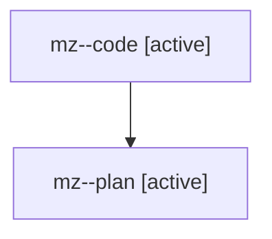

# Family: mz

[Agent Hoods](../README.md) / [bbugyi200](../users/bbugyi200/README.md) / [athena](../users/bbugyi200/machines/athena/README.md) / [mz](../users/bbugyi200/machines/athena/hoods/mz/README.md) / mz

Owner: `bbugyi200.athena` · Hood: `mz` · Members: 2

## Lineage

The diagram is an optional enhancement; the ordered table below contains the same lineage in accessible text.

| Role | Agent | State | Model / provider | Timing | Commits | Prompt | Chat |
|---|---|---|---|---|---:|---|---|
| code | mz--code | active | gpt-5.6-sol / codex | 2026-07-28T14:49:35.444812+00:00 | [1](../agents/bbugyi200.athena.mz--code/README.md#commits) | — | — |
| plan | mz--plan | active | opus / claude | 2026-07-28T13:52:02.462790+00:00 | 0 | [Prompt](../agents/bbugyi200.athena.mz--plan/prompt.md) | [Chat](../agents/bbugyi200.athena.mz--plan/chat.md) |

## Commits

| Role | Commit | Subject | Committed (UTC) |
|---|---|---|---|
| code | [`13e3b1d`](https://github.com/sase-org/sase/commit/13e3b1ddc93a77b1fdc1aece5c26aecad554eae1) | fix: settle stopped family predecessors | 2026-07-28 15:05:19 |
