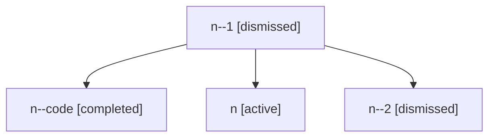

# Family: n

[Agent Hoods](../README.md) / [bbugyi200](../users/bbugyi200/README.md) / [athena](../users/bbugyi200/machines/athena/README.md) / [n](../users/bbugyi200/machines/athena/hoods/n/README.md) / n

Owner: `bbugyi200.athena` · Hood: `n` · Members: 4

## Lineage

The diagram is an optional enhancement; the ordered table below contains the same lineage in accessible text.

| Role | Agent | State | Model / provider | Timing | Commits | Prompt | Chat |
|---|---|---|---|---|---:|---|---|
| 1 | n--1 | dismissed | sonnet / claude | 2026-09-10T12:57:17.304162 | 0 | — | — |
| code | n--code | completed | gpt-5.5 / codex | 2026-07-06T20:19:34.800121+00:00 | 0 | — | [Chat](../agents/bbugyi200.athena.n--code/chat.md) |
| root | n | active | gpt-5.5 / codex | 2026-07-06T20:14:16.018057+00:00 | [1](../agents/bbugyi200.athena.n/README.md#commits) | [Prompt](../agents/bbugyi200.athena.n/prompt.md) | [Chat](../agents/bbugyi200.athena.n/chat.md) |
| 2 | n--2 | dismissed | sonnet / claude | 2026-09-10T12:57:17.304845 | 0 | — | — |

## Commits

| Role | Repo | Commit | Subject | Committed |
|---|---|---|---|---|
| root | sase | [`9595caa`](https://github.com/sase-org/sase/commit/9595caae0c5ec91d741f76d04cf7c6d91e09c2d2) | chore: Add SDD prompt and plan for telegram\_stale\_launch\_feedback | 2026-07-06 16:19:33 EDT |
