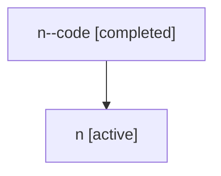

# Family: n

Owner: `bbugyi200.athena` · Hood: `n` · Members: 2

## Lineage

The diagram is an optional enhancement; the ordered table below contains the same lineage in accessible text.

| Role | Agent | State | Model / provider | Timing | Commits | Prompt | Chat |
|---|---|---|---|---|---:|---|---|
| code | n--code | completed | gpt-5.5 / codex | 2026-07-06T20:19:34.800121+00:00 | 0 | — | [Chat](../agents/bbugyi200.athena.n--code/chat.md) |
| root | n | active | gpt-5.5 / codex | 2026-07-06T20:14:16.018057+00:00 | 1 | [Prompt](../agents/bbugyi200.athena.n/prompt.md) | [Chat](../agents/bbugyi200.athena.n/chat.md) |
