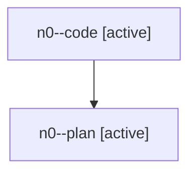

# Family: n0

[Agent Hoods](../README.md) / [bbugyi200](../users/bbugyi200/README.md) / [athena](../users/bbugyi200/machines/athena/README.md) / [n0](../users/bbugyi200/machines/athena/hoods/n0/README.md) / n0

Owner: `bbugyi200.athena` · Hood: `n0` · Members: 2

## Lineage

The diagram is an optional enhancement; the ordered table below contains the same lineage in accessible text.

| Role | Agent | State | Model / provider | Timing | Commits | Prompt | Chat |
|---|---|---|---|---|---:|---|---|
| code | n0--code | active | gpt-5.6-sol / codex | 2026-07-28T15:30:11.743988+00:00 | [1](../agents/bbugyi200.athena.n0--code/README.md#commits) | — | — |
| plan | n0--plan | active | opus / claude | 2026-07-28T15:18:56.327194+00:00 | 0 | [Prompt](../agents/bbugyi200.athena.n0--plan/prompt.md) | [Chat](../agents/bbugyi200.athena.n0--plan/chat.md) |

## Commits

| Role | Commit | Subject | Committed (UTC) |
|---|---|---|---|
| code | [`d5e1017`](https://github.com/sase-org/sase/commit/d5e10175dfcc58a1d1df0e9b1800f5dcc1b87fa2) | feat(cli): support multiline output variable values | 2026-07-28 15:53:35 |
