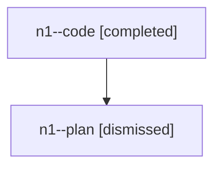

# Family: n1

[Agent Hoods](../README.md) / [bbugyi200](../users/bbugyi200/README.md) / [athena](../users/bbugyi200/machines/athena/README.md) / [n1](../users/bbugyi200/machines/athena/hoods/n1/README.md) / n1

Owner: `bbugyi200.athena` · Hood: `n1` · Members: 2

## Lineage

The diagram is an optional enhancement; the ordered table below contains the same lineage in accessible text.

| Role | Agent | State | Model / provider | Timing | Commits | Prompt | Chat |
|---|---|---|---|---|---:|---|---|
| code | n1--code | completed | gpt-5.6-sol / codex | 2026-07-28T15:50:41.672832+00:00 | [1](../agents/bbugyi200.athena.n1--code/README.md#commits) | — | [Chat](../agents/bbugyi200.athena.n1--code/chat.md) |
| plan | n1--plan | dismissed | opus / claude | 2026-07-28T11:42:36.051059 → 2026-07-28T12:16:40.845308 | 0 | — | [Chat](../agents/bbugyi200.athena.n1--plan/chat.md) |

## Commits

| Role | Commit | Subject | Committed (UTC) |
|---|---|---|---|
| code | [`4dcb779`](https://github.com/sase-org/sase/commit/4dcb77960eb8484913c531cd53e64914f3231f42) | feat(ace): show phase titles in BEAD context | 2026-07-28 16:14:56 |
