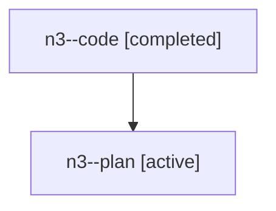

# Family: n3

[Agent Hoods](../README.md) / [bbugyi200](../users/bbugyi200/README.md) / [athena](../users/bbugyi200/machines/athena/README.md) / [n3](../users/bbugyi200/machines/athena/hoods/n3/README.md) / n3

Owner: `bbugyi200.athena` · Hood: `n3` · Members: 2

## Lineage

The diagram is an optional enhancement; the ordered table below contains the same lineage in accessible text.

| Role | Agent | State | Model / provider | Timing | Commits | Prompt | Chat |
|---|---|---|---|---|---:|---|---|
| code | n3--code | completed | gpt-5.6-sol / codex | 2026-07-28T15:57:34.493538+00:00 | [1](../agents/bbugyi200.athena.n3--code/README.md#commits) | — | [Chat](../agents/bbugyi200.athena.n3--code/chat.md) |
| plan | n3--plan | active | opus / claude | 2026-07-28T15:44:26.881315+00:00 | 0 | [Prompt](../agents/bbugyi200.athena.n3--plan/prompt.md) | [Chat](../agents/bbugyi200.athena.n3--plan/chat.md) |

## Commits

| Role | Repo | Commit | Subject | Committed |
|---|---|---|---|---|
| code | sase | [`ad3c751`](https://github.com/sase-org/sase/commit/ad3c75151077382cc7f77fe67556b77bb875aadb) | fix(xprompt): preserve trailing punctuation in completion | 2026-07-28 16:17:06 UTC |
