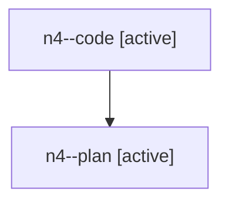

# Family: n4

[Agent Hoods](../README.md) / [bbugyi200](../users/bbugyi200/README.md) / [athena](../users/bbugyi200/machines/athena/README.md) / [n4](../users/bbugyi200/machines/athena/hoods/n4/README.md) / n4

Owner: `bbugyi200.athena` · Hood: `n4` · Members: 2

## Lineage

The diagram is an optional enhancement; the ordered table below contains the same lineage in accessible text.

| Role | Agent | State | Model / provider | Timing | Commits | Prompt | Chat |
|---|---|---|---|---|---:|---|---|
| code | n4--code | active | gpt-5.6-sol / codex | 2026-07-28T15:56:43.035270+00:00 | [1](../agents/bbugyi200.athena.n4--code/README.md#commits) | — | — |
| plan | n4--plan | active | opus / claude | 2026-07-28T15:48:02.809817+00:00 | 0 | [Prompt](../agents/bbugyi200.athena.n4--plan/prompt.md) | [Chat](../agents/bbugyi200.athena.n4--plan/chat.md) |

## Commits

| Role | Commit | Subject | Committed (UTC) |
|---|---|---|---|
| code | [`18d0d92`](https://github.com/sase-org/sase/commit/18d0d924179e250a32cd14f048fbce01f4acbe6f) | fix(tui): preserve active prompts on Ctrl+Space | 2026-07-28 16:20:52 |
