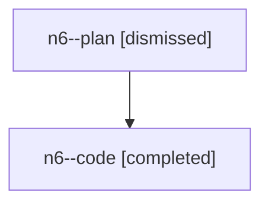

# Family: n6

[Agent Hoods](../README.md) / [bbugyi200](../users/bbugyi200/README.md) / [athena](../users/bbugyi200/machines/athena/README.md) / [n6](../users/bbugyi200/machines/athena/hoods/n6/README.md) / n6

Owner: `bbugyi200.athena` · Hood: `n6` · Members: 2

## Lineage

The diagram is an optional enhancement; the ordered table below contains the same lineage in accessible text.

| Role | Agent | State | Model / provider | Timing | Commits | Prompt | Chat |
|---|---|---|---|---|---:|---|---|
| plan | n6--plan | dismissed | gpt-5.6-sol / codex | 2026-07-28T12:46:48.372122 → 2026-07-28T13:18:36.766032 | 0 | — | [Chat](../agents/bbugyi200.athena.n6--plan/chat.md) |
| code | n6--code | completed | gpt-5.6-sol / codex | 2026-07-28T16:52:44.328462+00:00 | [1](../agents/bbugyi200.athena.n6--code/README.md#commits) | — | [Chat](../agents/bbugyi200.athena.n6--code/chat.md) |

## Commits

| Role | Commit | Subject | Committed (UTC) |
|---|---|---|---|
| code | [`d4198f1`](https://github.com/sase-org/sase/commit/d4198f1cc9b1e87b361fd80b6e0f99c94c5cec27) | feat: illustrate agents sidecar lifecycle | 2026-07-28 17:17:44 |

## Neighbors

| Agent | Relation | State |
|---|---|---|
| [n6.f0](../agents/bbugyi200.athena.n6.f0/README.md) | descendant | dismissed |
| [n6.f0.f0](../agents/bbugyi200.athena.n6.f0.f0/README.md) | descendant | failed |
| [n6.f0.f1](../agents/bbugyi200.athena.n6.f0.f1/README.md) | descendant | dismissed |
