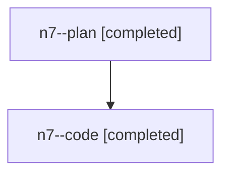

# Family: n7

[Agent Hoods](../README.md) / [bbugyi200](../users/bbugyi200/README.md) / [athena](../users/bbugyi200/machines/athena/README.md) / [n7](../users/bbugyi200/machines/athena/hoods/n7/README.md) / n7

Owner: `bbugyi200.athena` · Hood: `n7` · Members: 2

## Lineage

The diagram is an optional enhancement; the ordered table below contains the same lineage in accessible text.

| Role | Agent | State | Model / provider | Timing | Commits | Prompt | Chat |
|---|---|---|---|---|---:|---|---|
| plan | n7--plan | completed | opus / claude | 2026-07-28T16:52:17.004252+00:00 | 0 | [Prompt](../agents/bbugyi200.athena.n7--plan/prompt.md) | [Chat](../agents/bbugyi200.athena.n7--plan/chat.md) |
| code | n7--code | completed | gpt-5.6-sol / codex | 2026-07-28T17:00:30.005332+00:00 | [1](../agents/bbugyi200.athena.n7--code/README.md#commits) | — | [Chat](../agents/bbugyi200.athena.n7--code/chat.md) |

## Commits

| Role | Commit | Subject | Committed (UTC) |
|---|---|---|---|
| code | [`ee087a3`](https://github.com/sase-org/sase/commit/ee087a3df01a59617c8a8650ee333b127c5393b3) | fix(sdd): defer type-only annotations at runtime | 2026-07-28 17:15:34 |
