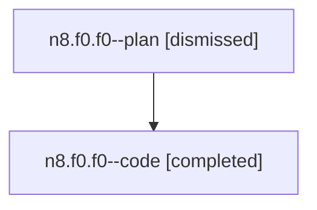

# Family: n8.f0.f0

[Agent Hoods](../README.md) / [bbugyi200](../users/bbugyi200/README.md) / [athena](../users/bbugyi200/machines/athena/README.md) / [n8](../users/bbugyi200/machines/athena/hoods/n8/README.md) / n8.f0.f0

Owner: `bbugyi200.athena` · Hood: `n8` · Members: 2

## Lineage

The diagram is an optional enhancement; the ordered table below contains the same lineage in accessible text.

| Role | Agent | State | Model / provider | Timing | Commits | Prompt | Chat |
|---|---|---|---|---|---:|---|---|
| plan | n8.f0.f0--plan | dismissed | opus / claude | 2026-07-28T13:08:28.871428 → 2026-07-28T13:38:20.349715 | 0 | — | [Chat](../agents/bbugyi200.athena.n8.f0.f0--plan/chat.md) |
| code | n8.f0.f0--code | completed | gpt-5.6-sol / codex | 2026-07-28T17:18:42.053075+00:00 | [1](../agents/bbugyi200.athena.n8.f0.f0--code/README.md#commits) | — | [Chat](../agents/bbugyi200.athena.n8.f0.f0--code/chat.md) |

## Commits

| Role | Repo | Commit | Subject | Committed (UTC) |
|---|---|---|---|---|
| code | sase | [`8049b46`](https://github.com/sase-org/sase/commit/8049b46ccb83fa3f88ecb8aba4d70545111f19aa) | fix: label sidecar commits by repository role | 2026-07-28 17:37:31 |

## Neighbors

| Agent | Relation | State |
|---|---|---|
| [n8.f0](../agents/bbugyi200.athena.n8.f0/README.md) | ancestor | dismissed |
| [n8](../agents/bbugyi200.athena.n8/README.md) | ancestor | dismissed |
