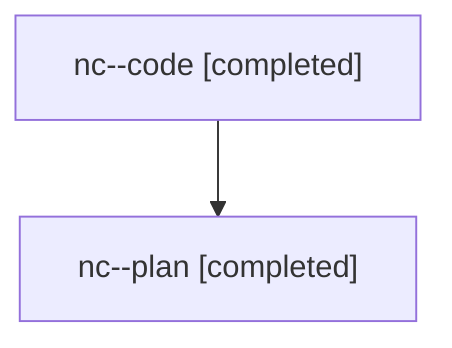

# Family: nc

[Agent Hoods](../README.md) / [bbugyi200](../users/bbugyi200/README.md) / [athena](../users/bbugyi200/machines/athena/README.md) / [nc](../users/bbugyi200/machines/athena/hoods/nc/README.md) / nc

Owner: `bbugyi200.athena` · Hood: `nc` · Members: 2

## Lineage

The diagram is an optional enhancement; the ordered table below contains the same lineage in accessible text.

| Role | Agent | State | Model / provider | Timing | Commits | Prompt | Chat |
|---|---|---|---|---|---:|---|---|
| code | nc--code | completed | gpt-5.6-sol / codex | 2026-07-28T19:52:15.681332+00:00 | [1](../agents/bbugyi200.athena.nc--code/README.md#commits) | — | [Chat](../agents/bbugyi200.athena.nc--code/chat.md) |
| plan | nc--plan | completed | opus / claude | 2026-07-28T19:43:36.931213+00:00 | 0 | [Prompt](../agents/bbugyi200.athena.nc--plan/prompt.md) | [Chat](../agents/bbugyi200.athena.nc--plan/chat.md) |

## Commits

| Role | Commit | Subject | Committed (UTC) |
|---|---|---|---|
| code | [`9cdfb37`](https://github.com/sase-org/sase/commit/9cdfb378a43753436abac5a9c673f4efa8c60e51) | fix(ace): escape dead-end panel row focus | 2026-07-28 20:16:27 |
