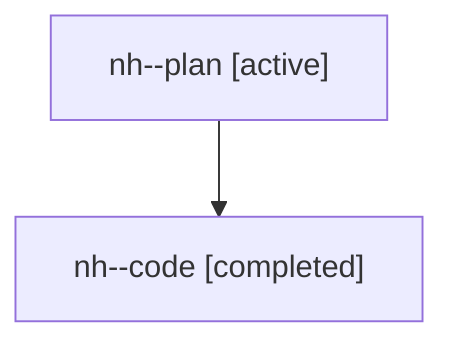

# Family: nh

[Agent Hoods](../README.md) / [bbugyi200](../users/bbugyi200/README.md) / [athena](../users/bbugyi200/machines/athena/README.md) / [nh](../users/bbugyi200/machines/athena/hoods/nh/README.md) / nh

Owner: `bbugyi200.athena` · Hood: `nh` · Members: 2

## Lineage

The diagram is an optional enhancement; the ordered table below contains the same lineage in accessible text.

| Role | Agent | State | Model / provider | Timing | Commits | Prompt | Chat |
|---|---|---|---|---|---:|---|---|
| plan | nh--plan | active | gpt-5.6-sol / codex | 2026-07-28T21:28:46.731520+00:00 | 0 | [Prompt](../agents/bbugyi200.athena.nh--plan/prompt.md) | [Chat](../agents/bbugyi200.athena.nh--plan/chat.md) |
| code | nh--code | completed | gpt-5.6-sol / codex | 2026-07-28T21:36:56.243863+00:00 | [1](../agents/bbugyi200.athena.nh--code/README.md#commits) | — | [Chat](../agents/bbugyi200.athena.nh--code/chat.md) |

## Commits

| Role | Repo | Commit | Subject | Committed |
|---|---|---|---|---|
| code | sase | [`5568411`](https://github.com/sase-org/sase/commit/5568411c9545b2c34bd112fb30f0d39afd4aacc2) | fix(tui): tighten commas after xprompt completions | 2026-07-28 18:00:32 EDT |
