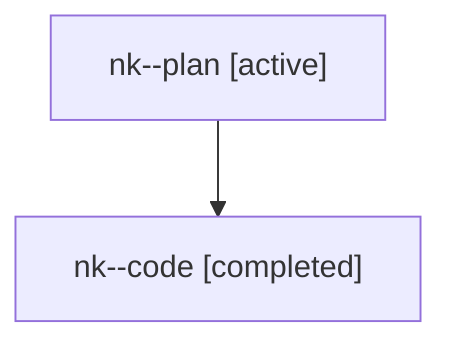

# Family: nk

[Agent Hoods](../README.md) / [bbugyi200](../users/bbugyi200/README.md) / [athena](../users/bbugyi200/machines/athena/README.md) / [nk](../users/bbugyi200/machines/athena/hoods/nk/README.md) / nk

Owner: `bbugyi200.athena` · Hood: `nk` · Members: 2

## Lineage

The diagram is an optional enhancement; the ordered table below contains the same lineage in accessible text.

| Role | Agent | State | Model / provider | Timing | Commits | Prompt | Chat |
|---|---|---|---|---|---:|---|---|
| plan | nk--plan | active | opus / claude | 2026-07-28T21:39:16.384464+00:00 | 0 | [Prompt](../agents/bbugyi200.athena.nk--plan/prompt.md) | [Chat](../agents/bbugyi200.athena.nk--plan/chat.md) |
| code | nk--code | completed | gpt-5.6-sol / codex | 2026-07-28T21:46:14.244608+00:00 | [1](../agents/bbugyi200.athena.nk--code/README.md#commits) | — | [Chat](../agents/bbugyi200.athena.nk--code/chat.md) |

## Commits

| Role | Repo | Commit | Subject | Committed |
|---|---|---|---|---|
| code | sase | [`d8c2f50`](https://github.com/sase-org/sase/commit/d8c2f5019f58e957b34e124f735899dcadc3a307) | feat(agents): classify all runner-slot waiters as queued | 2026-07-28 22:08:19 UTC |
