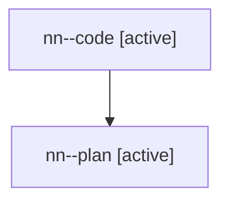

# Family: nn

[Agent Hoods](../README.md) / [bbugyi200](../users/bbugyi200/README.md) / [athena](../users/bbugyi200/machines/athena/README.md) / [nn](../users/bbugyi200/machines/athena/hoods/nn/README.md) / nn

Owner: `bbugyi200.athena` · Hood: `nn` · Members: 2

## Lineage

The diagram is an optional enhancement; the ordered table below contains the same lineage in accessible text.

| Role | Agent | State | Model / provider | Timing | Commits | Prompt | Chat |
|---|---|---|---|---|---:|---|---|
| code | nn--code | active | gpt-5.6-sol / codex | 2026-07-28T22:03:49.917592+00:00 | 0 | — | — |
| plan | nn--plan | active | claude-fable-5 / claude | 2026-07-28T21:55:28.312780+00:00 | 0 | [Prompt](../agents/bbugyi200.athena.nn--plan/prompt.md) | [Chat](../agents/bbugyi200.athena.nn--plan/chat.md) |
