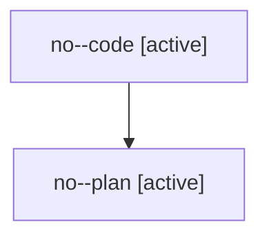

# Family: no

[Agent Hoods](../README.md) / [bbugyi200](../users/bbugyi200/README.md) / [athena](../users/bbugyi200/machines/athena/README.md) / [no](../users/bbugyi200/machines/athena/hoods/no/README.md) / no

Owner: `bbugyi200.athena` · Hood: `no` · Members: 2

## Lineage

The diagram is an optional enhancement; the ordered table below contains the same lineage in accessible text.

| Role | Agent | State | Model / provider | Timing | Commits | Prompt | Chat |
|---|---|---|---|---|---:|---|---|
| code | no--code | active | gpt-5.6-sol / codex | 2026-07-28T22:20:21.409452+00:00 | 0 | — | — |
| plan | no--plan | active | opus / claude | 2026-07-28T22:15:12.441374+00:00 | 0 | [Prompt](../agents/bbugyi200.athena.no--plan/prompt.md) | [Chat](../agents/bbugyi200.athena.no--plan/chat.md) |
