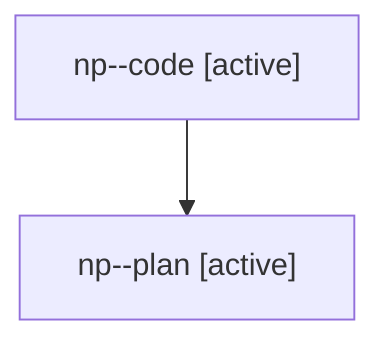

# Family: np

[Agent Hoods](../README.md) / [bbugyi200](../users/bbugyi200/README.md) / [athena](../users/bbugyi200/machines/athena/README.md) / [np](../users/bbugyi200/machines/athena/hoods/np/README.md) / np

Owner: `bbugyi200.athena` · Hood: `np` · Members: 2

## Lineage

The diagram is an optional enhancement; the ordered table below contains the same lineage in accessible text.

| Role | Agent | State | Model / provider | Timing | Commits | Prompt | Chat |
|---|---|---|---|---|---:|---|---|
| code | np--code | active | gpt-5.6-sol / codex | 2026-07-28T22:43:13.474540+00:00 | 0 | — | — |
| plan | np--plan | active | gpt-5.6-sol / codex | 2026-07-28T22:37:35.737785+00:00 | 0 | [Prompt](../agents/bbugyi200.athena.np--plan/prompt.md) | [Chat](../agents/bbugyi200.athena.np--plan/chat.md) |
