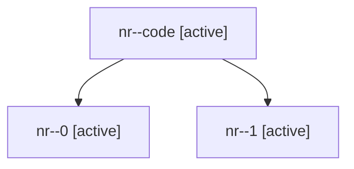

# Family: nr

[Agent Hoods](../README.md) / [bbugyi200](../users/bbugyi200/README.md) / [athena](../users/bbugyi200/machines/athena/README.md) / [nr](../users/bbugyi200/machines/athena/hoods/nr/README.md) / nr

Owner: `bbugyi200.athena` · Hood: `nr` · Members: 3

## Lineage

The diagram is an optional enhancement; the ordered table below contains the same lineage in accessible text.

| Role | Agent | State | Model / provider | Timing | Commits | Prompt | Chat |
|---|---|---|---|---|---:|---|---|
| code | nr--code | active | gpt-5.6-sol / codex | 2026-07-29T10:35:42.569605+00:00 | [1](../agents/bbugyi200.athena.nr--code/README.md#commits) | — | — |
| 0 | nr--0 | active | opus / claude | 2026-07-29T10:23:20.936976+00:00 | 0 | [Prompt](../agents/bbugyi200.athena.nr--0/prompt.md) | [Chat](../agents/bbugyi200.athena.nr--0/chat.md) |
| 1 | nr--1 | active | opus / claude | 2026-07-29T10:30:58.644019+00:00 | 0 | — | [Chat](../agents/bbugyi200.athena.nr--1/chat.md) |

## Commits

| Role | Repo | Commit | Subject | Committed (UTC) |
|---|---|---|---|---|
| code | sase | [`cca22e6`](https://github.com/sase-org/sase/commit/cca22e64d9648386ad52631f8f0217a55cc01f55) | refactor(ace): rename collapse houses to lanes | 2026-07-29 10:52:28 |
