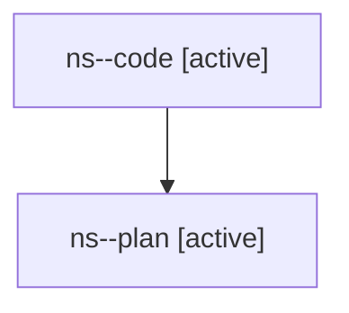

# Family: ns

[Agent Hoods](../README.md) / [bbugyi200](../users/bbugyi200/README.md) / [athena](../users/bbugyi200/machines/athena/README.md) / [ns](../users/bbugyi200/machines/athena/hoods/ns/README.md) / ns

Owner: `bbugyi200.athena` · Hood: `ns` · Members: 2

## Lineage

The diagram is an optional enhancement; the ordered table below contains the same lineage in accessible text.

| Role | Agent | State | Model / provider | Timing | Commits | Prompt | Chat |
|---|---|---|---|---|---:|---|---|
| code | ns--code | active | gpt-5.6-sol / codex | 2026-07-29T10:40:37.679976+00:00 | 0 | — | — |
| plan | ns--plan | active | opus / claude | 2026-07-29T10:30:10.404682+00:00 | 0 | [Prompt](../agents/bbugyi200.athena.ns--plan/prompt.md) | [Chat](../agents/bbugyi200.athena.ns--plan/chat.md) |
