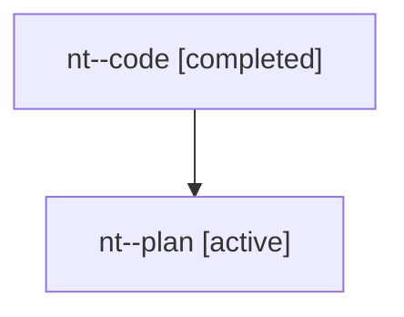

# Family: nt

[Agent Hoods](../README.md) / [bbugyi200](../users/bbugyi200/README.md) / [athena](../users/bbugyi200/machines/athena/README.md) / [nt](../users/bbugyi200/machines/athena/hoods/nt/README.md) / nt

Owner: `bbugyi200.athena` · Hood: `nt` · Members: 2

## Lineage

The diagram is an optional enhancement; the ordered table below contains the same lineage in accessible text.

| Role | Agent | State | Model / provider | Timing | Commits | Prompt | Chat |
|---|---|---|---|---|---:|---|---|
| code | nt--code | completed | gpt-5.6-sol / codex | 2026-07-29T10:47:42.156705+00:00 | [1](../agents/bbugyi200.athena.nt--code/README.md#commits) | — | [Chat](../agents/bbugyi200.athena.nt--code/chat.md) |
| plan | nt--plan | active | opus / claude | 2026-07-29T10:34:20.271603+00:00 | 0 | [Prompt](../agents/bbugyi200.athena.nt--plan/prompt.md) | [Chat](../agents/bbugyi200.athena.nt--plan/chat.md) |

## Commits

| Role | Repo | Commit | Subject | Committed |
|---|---|---|---|---|
| code | sase | [`e7e4121`](https://github.com/sase-org/sase/commit/e7e41216496356c24fa1268ca4fd4e4d67c02216) | fix(ace): mark handed-off root questions answered | 2026-07-29 06:56:48 EDT |
