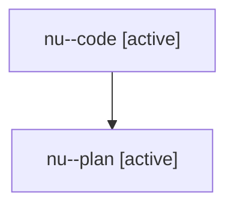

# Family: nu

[Agent Hoods](../README.md) / [bbugyi200](../users/bbugyi200/README.md) / [athena](../users/bbugyi200/machines/athena/README.md) / [nu](../users/bbugyi200/machines/athena/hoods/nu/README.md) / nu

Owner: `bbugyi200.athena` · Hood: `nu` · Members: 2

## Lineage

The diagram is an optional enhancement; the ordered table below contains the same lineage in accessible text.

| Role | Agent | State | Model / provider | Timing | Commits | Prompt | Chat |
|---|---|---|---|---|---:|---|---|
| code | nu--code | active | gpt-5.6-sol / codex | 2026-07-29T10:55:56.566929+00:00 | [1](../agents/bbugyi200.athena.nu--code/README.md#commits) | — | — |
| plan | nu--plan | active | opus / claude | 2026-07-29T10:45:04.053734+00:00 | 0 | [Prompt](../agents/bbugyi200.athena.nu--plan/prompt.md) | [Chat](../agents/bbugyi200.athena.nu--plan/chat.md) |

## Commits

| Role | Commit | Subject | Committed (UTC) |
|---|---|---|---|
| code | [`2110954`](https://github.com/sase-org/sase/commit/2110954eb1d6833a03228298d5716681d484980a) | feat(tui): show tribe panel entry target | 2026-07-29 11:19:24 |
