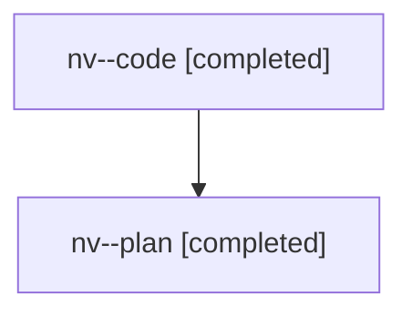

# Family: nv

[Agent Hoods](../README.md) / [bbugyi200](../users/bbugyi200/README.md) / [athena](../users/bbugyi200/machines/athena/README.md) / [nv](../users/bbugyi200/machines/athena/hoods/nv/README.md) / nv

Owner: `bbugyi200.athena` · Hood: `nv` · Members: 2

## Lineage

The diagram is an optional enhancement; the ordered table below contains the same lineage in accessible text.

| Role | Agent | State | Model / provider | Timing | Commits | Prompt | Chat |
|---|---|---|---|---|---:|---|---|
| code | nv--code | completed | gpt-5.6-sol / codex | 2026-07-29T11:23:19.688683+00:00 | [1](../agents/bbugyi200.athena.nv--code/README.md#commits) | — | [Chat](../agents/bbugyi200.athena.nv--code/chat.md) |
| plan | nv--plan | completed | opus / claude | 2026-07-29T11:14:41.565694+00:00 | 0 | [Prompt](../agents/bbugyi200.athena.nv--plan/prompt.md) | [Chat](../agents/bbugyi200.athena.nv--plan/chat.md) |

## Commits

| Role | Repo | Commit | Subject | Committed |
|---|---|---|---|---|
| code | sase | [`7e20cd2`](https://github.com/sase-org/sase/commit/7e20cd22e847c12fc6e435e6da4003e9d054f358) | fix(ace): remove PDF activity from agent rows | 2026-07-29 07:54:32 EDT |
