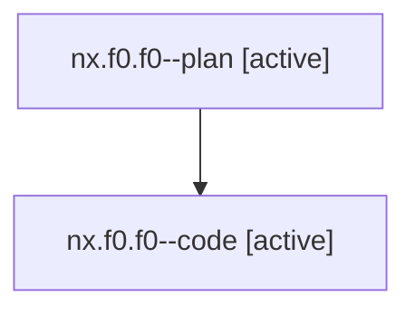

# Family: nx.f0.f0

[Agent Hoods](../README.md) / [bbugyi200](../users/bbugyi200/README.md) / [athena](../users/bbugyi200/machines/athena/README.md) / [nx](../users/bbugyi200/machines/athena/hoods/nx/README.md) / nx.f0.f0

Owner: `bbugyi200.athena` · Hood: `nx` · Members: 2

## Lineage

The diagram is an optional enhancement; the ordered table below contains the same lineage in accessible text.

| Role | Agent | State | Model / provider | Timing | Commits | Prompt | Chat |
|---|---|---|---|---|---:|---|---|
| plan | nx.f0.f0--plan | active | opus / claude | 2026-07-29T13:53:19.879968+00:00 | 0 | [Prompt](../agents/bbugyi200.athena.nx.f0.f0--plan/prompt.md) | [Chat](../agents/bbugyi200.athena.nx.f0.f0--plan/chat.md) |
| code | nx.f0.f0--code | active | gpt-5.6-sol / codex | 2026-07-29T14:02:56.560368+00:00 | [1](../agents/bbugyi200.athena.nx.f0.f0--code/README.md#commits) | — | — |

## Commits

| Role | Repo | Commit | Subject | Committed (UTC) |
|---|---|---|---|---|
| code | sase | [`13b8aab`](https://github.com/sase-org/sase/commit/13b8aab3687aefc453a9cdf7681572a24ed91844) | fix: keep epic page labels inline with URLs | 2026-07-29 14:26:44 |

## Neighbors

| Agent | Relation | State |
|---|---|---|
| [nx.f0](bbugyi200.athena.nx.f0.md) (family · 2) | ancestor | completed 2 |
| [nx](bbugyi200.athena.nx.md) (family · 2) | ancestor | completed 1, dismissed 1 |
