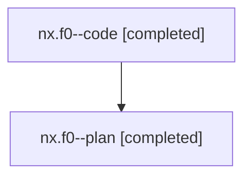

# Family: nx.f0

[Agent Hoods](../README.md) / [bbugyi200](../users/bbugyi200/README.md) / [athena](../users/bbugyi200/machines/athena/README.md) / [nx](../users/bbugyi200/machines/athena/hoods/nx/README.md) / nx.f0

Owner: `bbugyi200.athena` · Hood: `nx` · Members: 2

## Lineage

The diagram is an optional enhancement; the ordered table below contains the same lineage in accessible text.

| Role | Agent | State | Model / provider | Timing | Commits | Prompt | Chat |
|---|---|---|---|---|---:|---|---|
| code | nx.f0--code | completed | gpt-5.6-sol / codex | 2026-07-29T12:49:24.201393+00:00 | [1](../agents/bbugyi200.athena.nx.f0--code/README.md#commits) | — | [Chat](../agents/bbugyi200.athena.nx.f0--code/chat.md) |
| plan | nx.f0--plan | completed | gpt-5.6-sol / codex | 2026-07-29T12:36:22.300534+00:00 | 0 | [Prompt](../agents/bbugyi200.athena.nx.f0--plan/prompt.md) | [Chat](../agents/bbugyi200.athena.nx.f0--plan/chat.md) |

## Commits

| Role | Commit | Subject | Committed (UTC) |
|---|---|---|---|
| code | [`9e5eadc`](https://github.com/sase-org/sase/commit/9e5eadc6b364d218571ea1cbde82f48d72f3d082) | fix: preserve epic bead page URLs | 2026-07-29 13:15:07 |

## Neighbors

| Agent | Relation | State |
|---|---|---|
| [nx](bbugyi200.athena.nx.md) (family · 2) | ancestor | completed 1, dismissed 1 |
| [nx.f0.f0](bbugyi200.athena.nx.f0.f0.md) (family · 2) | descendant | active 2 |
