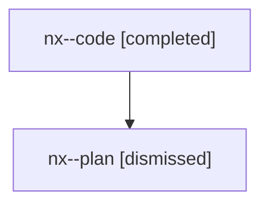

# Family: nx

[Agent Hoods](../README.md) / [bbugyi200](../users/bbugyi200/README.md) / [athena](../users/bbugyi200/machines/athena/README.md) / [nx](../users/bbugyi200/machines/athena/hoods/nx/README.md) / nx

Owner: `bbugyi200.athena` · Hood: `nx` · Members: 2

## Lineage

The diagram is an optional enhancement; the ordered table below contains the same lineage in accessible text.

| Role | Agent | State | Model / provider | Timing | Commits | Prompt | Chat |
|---|---|---|---|---|---:|---|---|
| code | nx--code | completed | gpt-5.6-sol / codex | 2026-07-29T12:13:13.751611+00:00 | [1](../agents/bbugyi200.athena.nx--code/README.md#commits) | — | [Chat](../agents/bbugyi200.athena.nx--code/chat.md) |
| plan | nx--plan | dismissed | opus / claude | 2026-07-29T07:59:28.244174 → 2026-07-29T08:36:09.741203 | 0 | — | [Chat](../agents/bbugyi200.athena.nx--plan/chat.md) |

## Commits

| Role | Repo | Commit | Subject | Committed |
|---|---|---|---|---|
| code | sase | [`f36f37d`](https://github.com/sase-org/sase/commit/f36f37d3ceb5154e1b23602f5ce50ed44eebb52d) | feat(ace): link epic summaries to hosted bead pages | 2026-07-29 08:35:18 EDT |

## Neighbors

| Agent | Relation | State |
|---|---|---|
| [nx.f0](bbugyi200.athena.nx.f0.md) (family · 2) | descendant | completed 2 |
| [nx.f0.f0](bbugyi200.athena.nx.f0.f0.md) (family · 2) | descendant | active 2 |
