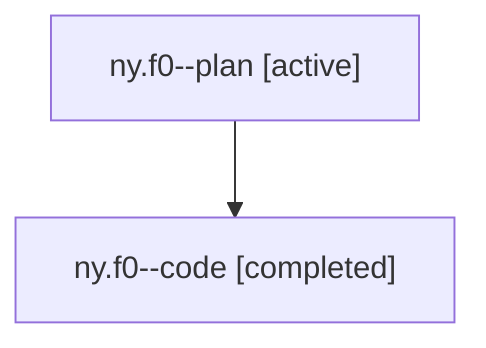

# Family: ny.f0

[Agent Hoods](../README.md) / [bbugyi200](../users/bbugyi200/README.md) / [athena](../users/bbugyi200/machines/athena/README.md) / [ny](../users/bbugyi200/machines/athena/hoods/ny/README.md) / ny.f0

Owner: `bbugyi200.athena` · Hood: `ny` · Members: 2

## Lineage

The diagram is an optional enhancement; the ordered table below contains the same lineage in accessible text.

| Role | Agent | State | Model / provider | Timing | Commits | Prompt | Chat |
|---|---|---|---|---|---:|---|---|
| plan | ny.f0--plan | active | opus / claude | 2026-07-29T12:20:28.545507+00:00 | 0 | [Prompt](../agents/bbugyi200.athena.ny.f0--plan/prompt.md) | [Chat](../agents/bbugyi200.athena.ny.f0--plan/chat.md) |
| code | ny.f0--code | completed | gpt-5.6-sol / codex | 2026-07-29T12:35:41.603273+00:00 | [1](../agents/bbugyi200.athena.ny.f0--code/README.md#commits) | — | [Chat](../agents/bbugyi200.athena.ny.f0--code/chat.md) |

## Commits

| Role | Repo | Commit | Subject | Committed |
|---|---|---|---|---|
| code | sase | [`1054f3b`](https://github.com/sase-org/sase/commit/1054f3b79dc1f8b71e8f5b2913f18f3b0a90a699) | feat(ace): delete persistent completion entries | 2026-07-29 12:59:41 UTC |

## Neighbors

| Agent | Relation | State |
|---|---|---|
| [ny](bbugyi200.athena.ny.md) (family · 2) | ancestor | active 1, completed 1 |
| [ny.f1](../agents/bbugyi200.athena.ny.f1/README.md) | ny hood | active |
| [ny.f1.f0](../agents/bbugyi200.athena.ny.f1.f0/README.md) | ny hood | active |
