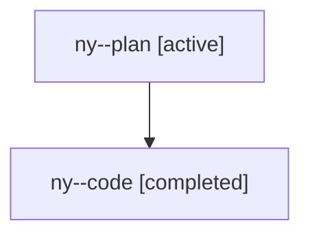

# Family: ny

[Agent Hoods](../README.md) / [bbugyi200](../users/bbugyi200/README.md) / [athena](../users/bbugyi200/machines/athena/README.md) / [ny](../users/bbugyi200/machines/athena/hoods/ny/README.md) / ny

Owner: `bbugyi200.athena` · Hood: `ny` · Members: 2

## Lineage

The diagram is an optional enhancement; the ordered table below contains the same lineage in accessible text.

| Role | Agent | State | Model / provider | Timing | Commits | Prompt | Chat |
|---|---|---|---|---|---:|---|---|
| plan | ny--plan | active | gpt-5.6-sol / codex | 2026-07-29T12:04:03.838852+00:00 | 0 | [Prompt](../agents/bbugyi200.athena.ny--plan/prompt.md) | [Chat](../agents/bbugyi200.athena.ny--plan/chat.md) |
| code | ny--code | completed | gpt-5.6-sol / codex | 2026-07-29T12:10:02.408090+00:00 | [1](../agents/bbugyi200.athena.ny--code/README.md#commits) | — | [Chat](../agents/bbugyi200.athena.ny--code/chat.md) |

## Commits

| Role | Repo | Commit | Subject | Committed |
|---|---|---|---|---|
| code | sase | [`4ee5cd0`](https://github.com/sase-org/sase/commit/4ee5cd092b45fe813c6e359f04f9248f8ff71c6a) | feat(ace): raise history word completion default | 2026-07-29 08:19:15 EDT |

## Neighbors

| Agent | Relation | State |
|---|---|---|
| [ny.f0](bbugyi200.athena.ny.f0.md) (family · 2) | descendant | active 1, completed 1 |
| [ny.f1](../agents/bbugyi200.athena.ny.f1/README.md) | descendant | active |
| [ny.f1.f0](../agents/bbugyi200.athena.ny.f1.f0/README.md) | descendant | active |
