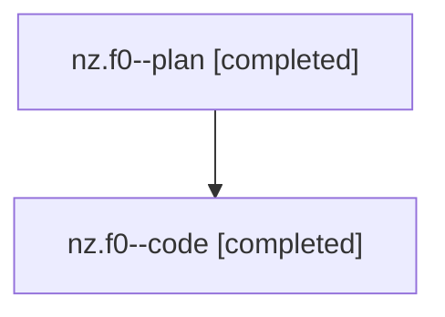

# Family: nz.f0

[Agent Hoods](../README.md) / [bbugyi200](../users/bbugyi200/README.md) / [athena](../users/bbugyi200/machines/athena/README.md) / [nz](../users/bbugyi200/machines/athena/hoods/nz/README.md) / nz.f0

Owner: `bbugyi200.athena` · Hood: `nz` · Members: 2

## Lineage

The diagram is an optional enhancement; the ordered table below contains the same lineage in accessible text.

| Role | Agent | State | Model / provider | Timing | Commits | Prompt | Chat |
|---|---|---|---|---|---:|---|---|
| plan | nz.f0--plan | completed | opus / claude | 2026-07-29T12:21:26.476632+00:00 | 0 | [Prompt](../agents/bbugyi200.athena.nz.f0--plan/prompt.md) | [Chat](../agents/bbugyi200.athena.nz.f0--plan/chat.md) |
| code | nz.f0--code | completed | gpt-5.6-sol / codex | 2026-07-29T12:35:50.178375+00:00 | [1](../agents/bbugyi200.athena.nz.f0--code/README.md#commits) | — | [Chat](../agents/bbugyi200.athena.nz.f0--code/chat.md) |

## Commits

| Role | Commit | Subject | Committed (UTC) |
|---|---|---|---|
| code | [`1e44e03`](https://github.com/sase-org/sase/commit/1e44e0367cdc1fa4fbf81b9dde350de8c45a8103) | fix(ace): restore prompt-local placeholder precedence | 2026-07-29 12:54:05 |

## Neighbors

| Agent | Relation | State |
|---|---|---|
| [nz](../agents/bbugyi200.athena.nz/README.md) | ancestor | completed |
