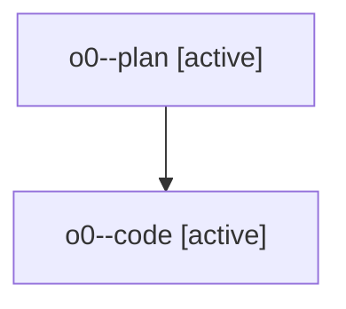

# Family: o0

[Agent Hoods](../README.md) / [bbugyi200](../users/bbugyi200/README.md) / [athena](../users/bbugyi200/machines/athena/README.md) / [o0](../users/bbugyi200/machines/athena/hoods/o0/README.md) / o0

Owner: `bbugyi200.athena` · Hood: `o0` · Members: 2

## Lineage

The diagram is an optional enhancement; the ordered table below contains the same lineage in accessible text.

| Role | Agent | State | Model / provider | Timing | Commits | Prompt | Chat |
|---|---|---|---|---|---:|---|---|
| plan | o0--plan | active | opus / claude | 2026-07-29T12:08:18.456138+00:00 | 0 | [Prompt](../agents/bbugyi200.athena.o0--plan/prompt.md) | [Chat](../agents/bbugyi200.athena.o0--plan/chat.md) |
| code | o0--code | active | gpt-5.6-sol / codex | 2026-07-29T12:15:33.869042+00:00 | [1](../agents/bbugyi200.athena.o0--code/README.md#commits) | — | — |

## Commits

| Role | Repo | Commit | Subject | Committed |
|---|---|---|---|---|
| code | sase | [`a813226`](https://github.com/sase-org/sase/commit/a8132265be0d7e27f93695c6ad3da8d3191ec217) | fix(ace): strip prompt bullet markers on join | 2026-07-29 08:39:25 EDT |
