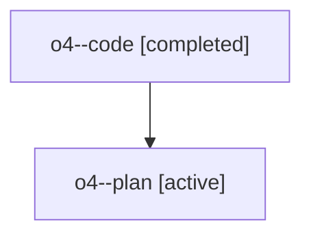

# Family: o4

[Agent Hoods](../README.md) / [bbugyi200](../users/bbugyi200/README.md) / [athena](../users/bbugyi200/machines/athena/README.md) / [o4](../users/bbugyi200/machines/athena/hoods/o4/README.md) / o4

Owner: `bbugyi200.athena` · Hood: `o4` · Members: 2

## Lineage

The diagram is an optional enhancement; the ordered table below contains the same lineage in accessible text.

| Role | Agent | State | Model / provider | Timing | Commits | Prompt | Chat |
|---|---|---|---|---|---:|---|---|
| code | o4--code | completed | gpt-5.6-sol / codex | 2026-07-29T13:07:37.918923+00:00 | [1](../agents/bbugyi200.athena.o4--code/README.md#commits) | — | [Chat](../agents/bbugyi200.athena.o4--code/chat.md) |
| plan | o4--plan | active | opus / claude | 2026-07-29T12:48:30.311249+00:00 | 0 | [Prompt](../agents/bbugyi200.athena.o4--plan/prompt.md) | [Chat](../agents/bbugyi200.athena.o4--plan/chat.md) |

## Commits

| Role | Repo | Commit | Subject | Committed |
|---|---|---|---|---|
| code | sase | [`65732cb`](https://github.com/sase-org/sase/commit/65732cb3b621319e012b44905d7bf50722f20e53) | fix: report lane counts in cleanup confirmations | 2026-07-29 09:36:44 EDT |
