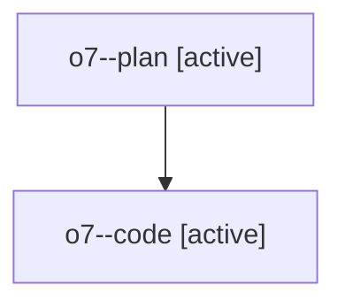

# Family: o7

[Agent Hoods](../README.md) / [bbugyi200](../users/bbugyi200/README.md) / [athena](../users/bbugyi200/machines/athena/README.md) / [o7](../users/bbugyi200/machines/athena/hoods/o7/README.md) / o7

Owner: `bbugyi200.athena` · Hood: `o7` · Members: 2

## Lineage

The diagram is an optional enhancement; the ordered table below contains the same lineage in accessible text.

| Role | Agent | State | Model / provider | Timing | Commits | Prompt | Chat |
|---|---|---|---|---|---:|---|---|
| plan | o7--plan | active | gpt-5.6-sol / codex | 2026-07-29T14:12:24.429916+00:00 | 0 | [Prompt](../agents/bbugyi200.athena.o7--plan/prompt.md) | [Chat](../agents/bbugyi200.athena.o7--plan/chat.md) |
| code | o7--code | active | gpt-5.6-sol / codex | 2026-07-29T14:17:17.378020+00:00 | [1](../agents/bbugyi200.athena.o7--code/README.md#commits) | — | — |

## Commits

| Role | Commit | Subject | Committed (UTC) |
|---|---|---|---|
| code | [`3463978`](https://github.com/sase-org/sase/commit/3463978fb3b571b5770eae676279ded54b39f780) | fix(ace): exit populated bullets with ctrl+j | 2026-07-29 14:31:18 |
