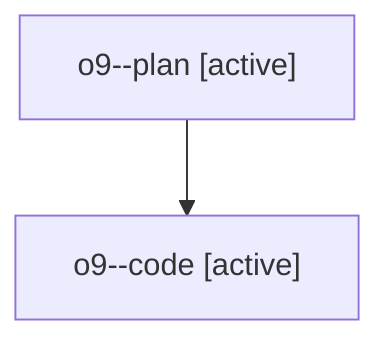

# Family: o9

[Agent Hoods](../README.md) / [bbugyi200](../users/bbugyi200/README.md) / [athena](../users/bbugyi200/machines/athena/README.md) / [o9](../users/bbugyi200/machines/athena/hoods/o9/README.md) / o9

Owner: `bbugyi200.athena` · Hood: `o9` · Members: 2

## Lineage

The diagram is an optional enhancement; the ordered table below contains the same lineage in accessible text.

| Role | Agent | State | Model / provider | Timing | Commits | Prompt | Chat |
|---|---|---|---|---|---:|---|---|
| plan | o9--plan | active | opus / claude | 2026-07-29T14:29:20.979992+00:00 | 0 | [Prompt](../agents/bbugyi200.athena.o9--plan/prompt.md) | [Chat](../agents/bbugyi200.athena.o9--plan/chat.md) |
| code | o9--code | active | gpt-5.6-sol / codex | 2026-07-29T14:39:22.066686+00:00 | [1](../agents/bbugyi200.athena.o9--code/README.md#commits) | — | — |

## Commits

| Role | Repo | Commit | Subject | Committed (UTC) |
|---|---|---|---|---|
| code | sase | [`9180a1f`](https://github.com/sase-org/sase/commit/9180a1fd67ae9b32231153fe65a2378fb179733c) | fix(config): initialize chezmoi machine overlays safely | 2026-07-29 14:59:21 |
