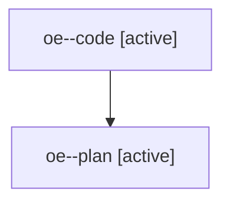

# Family: oe

[Agent Hoods](../README.md) / [bbugyi200](../users/bbugyi200/README.md) / [athena](../users/bbugyi200/machines/athena/README.md) / [oe](../users/bbugyi200/machines/athena/hoods/oe/README.md) / oe

Owner: `bbugyi200.athena` · Hood: `oe` · Members: 2

## Lineage

The diagram is an optional enhancement; the ordered table below contains the same lineage in accessible text.

| Role | Agent | State | Model / provider | Timing | Commits | Prompt | Chat |
|---|---|---|---|---|---:|---|---|
| code | oe--code | active | gpt-5.6-sol / codex | 2026-07-29T16:10:58.649672+00:00 | [1](../agents/bbugyi200.athena.oe--code/README.md#commits) | — | — |
| plan | oe--plan | active | opus / claude | 2026-07-29T16:01:13.730620+00:00 | 0 | [Prompt](../agents/bbugyi200.athena.oe--plan/prompt.md) | [Chat](../agents/bbugyi200.athena.oe--plan/chat.md) |

## Commits

| Role | Commit | Subject | Committed (UTC) |
|---|---|---|---|
| code | [`1f0296a`](https://github.com/sase-org/sase/commit/1f0296ade1a22ac55dbd93d410f0247e6befba3a) | feat(bead): close selected epic phases | 2026-07-29 16:34:01 |
