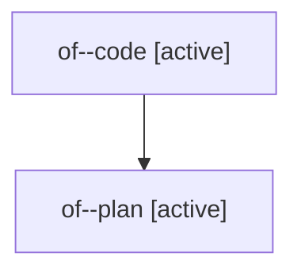

# Family: of

[Agent Hoods](../README.md) / [bbugyi200](../users/bbugyi200/README.md) / [athena](../users/bbugyi200/machines/athena/README.md) / [of](../users/bbugyi200/machines/athena/hoods/of/README.md) / of

Owner: `bbugyi200.athena` · Hood: `of` · Members: 2

## Lineage

The diagram is an optional enhancement; the ordered table below contains the same lineage in accessible text.

| Role | Agent | State | Model / provider | Timing | Commits | Prompt | Chat |
|---|---|---|---|---|---:|---|---|
| code | of--code | active | gpt-5.6-sol / codex | 2026-07-29T16:10:48.895829+00:00 | [1](../agents/bbugyi200.athena.of--code/README.md#commits) | — | — |
| plan | of--plan | active | opus / claude | 2026-07-29T16:04:33.001703+00:00 | 0 | [Prompt](../agents/bbugyi200.athena.of--plan/prompt.md) | [Chat](../agents/bbugyi200.athena.of--plan/chat.md) |

## Commits

| Role | Repo | Commit | Subject | Committed |
|---|---|---|---|---|
| code | sase | [`619de09`](https://github.com/sase-org/sase/commit/619de093a7e9f9cb86a05042fb402f2710039996) | fix(changelog): enforce release-please ownership | 2026-07-29 12:26:20 EDT |
